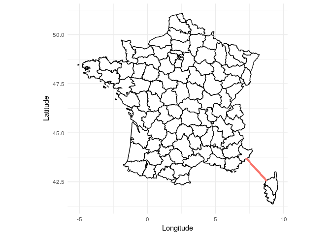

Etude d’un transect entre Nice et Calvi
================

## Avant-propos

Ce projet porte sur un transect entre Nice et Calvi. Ce dernier est un
projet qui va évoluer avec votre progression dans les différents
modules. Pour ce faire, suivez avec attention les attendus pour chaque
module.

Il est possible que ce document évolue au cours du temps. N’hésitez pas
à vérifier le lien suivant afin de voir les modifications dans les
consignes :
<https://github.com/BioDataScience-Course/spatial_distribution_zooplankton_ligurian_sea>

## Contexte

``` r
knitr::opts_chunk$set(echo = TRUE, message=FALSE, warning=FALSE)
# packages
SciViews::R
library(pastecs)
```

Des chercheurs ont réalisé un transect entre Nice et Calvi. Ils ont
décidé de 68 stations entre ces deux villes afin de prélever des
échantillons d’organismes planctoniques et de mesurer les paramètres
physico-chimiques de ces stations.

``` r
ggplot(map_data("france"), aes(long, lat, group = group)) +
  geom_polygon(fill= "white", color = "black") +
  geom_segment(
    aes(y = 43.7 , x = 7.25, yend = 42.56, xend= 8.75, color = "red"), 
    size = 1, show.legend = FALSE) +
  coord_quickmap() +
  theme_minimal() +
  labs( x = "Longitude", y = "Latitude")
```

<!-- -->

## Jeux de données

Deux jeux de données sont mis à votre disposition :

  - **marphy** comprend les mesures de température, de salinité, de
    fluorescence et de densité sur les 68 stations étudiées.

<!-- end list -->

``` r
marphy <- read("marphy", package = "pastecs", lang = "fr")
```

  - **marbio** comprend le dénombrement de différents groupes au sein du
    zooplancton sur les 68 stations étudiées.

<!-- end list -->

``` r
marbio <- read("marbio", package = "pastecs", lang = "fr")
```

## Objectif à la fin des modules

### Module 5

A la fin de ce module, vous devez avoir réalisé un document R Markdown
comme un carnet de notes (Notebook) qui comprend au minimum les parties
suivantes:

  - un but qui présente l’objectif de ce carnet de notes

  - une introduction qui présente le sujet biologique de votre carnet de
    notes.

  - une section résultat

La section résultat doit comprendre la réalisation de plusieurs matrice
de distance cohérentes et des dendrogrammes sur les jeux de données
`marphy` et `marbio`.

Si nous devions résumer la procédure de traitement des données, les
étapes sont les suivantes :

  - Transformation des données si nécéssaire

  - Choix de l’indice pour la matrice de distance

  - Choix de la méthode de regroupement pour le dendrogramme

  - Choix du nombre de classe ou du niveau de coupure dans le
    dendrogramme

### Module 6

A la fin de ce module, vous devez avoir ajouté une section à votre
document R Markdown (comme un carnet de notes (Notebook)) débuté lors du
module 5 portant sur la méthode des K-moyennes.

Réalisez un regroupement des stations avec la méthode des K-moyennes.
Comparez ensuite le regroupement obtenu avec K-moyennes et avec le CAH
